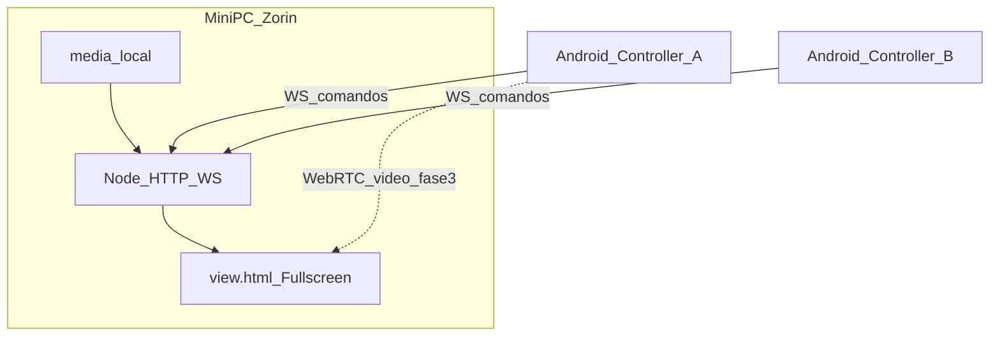
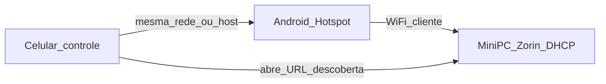

# Plano Diretor — Projeção ICM Mobile (LAN)

## 1. Diagnóstico atual

Hoje o sistema é **mesmo navegador / mesma máquina**:

- [`index.html`](index.html) + [`js/core.js`](js/core.js) abrem [`view.html`](view.html) via `window.open` e sincronizam com `postMessage` (`reloadReveal`, `changeSlide`, `changeTheme`, `changeFontSize`).
- Não há WebSocket, BroadcastChannel nem sync em rede.
- Há suporte visual a `video` no CSS do Reveal ([`css/theme/icm.css`](css/theme/icm.css)), mas **não há fluxo de mídia/vídeo na playlist**.
- Docs existentes ([`README.md`](README.md), [`docs/manual.md`](docs/manual.md)) cobrem só o painel desktop local.

**Conclusão:** o objetivo (celular controla PC Zorin → projetor) é **viável**, mas exige nova camada de transporte + painel mobile + servidor no mini PC.

---

## 2. Visão do produto

| Papel | Dispositivo | URL / app |
|-------|-------------|-----------|
| Display (projeção) | Mini PC Zorin + projetor | `http://<ip-pc>:8080/view.html` (tela cheia) |
| Controle | Android (1..N celulares) | `http://<ip-pc>:8080/mobile.html` ou PWA instalada |
| Admin / edição pesada | PC ou tablet | `index.html` atual (mantido), também conectado ao relay |

Fluxo alvo:



**Decisões fixas deste plano:**

1. **Servidor no Zorin:** Node.js (Express estático + `ws`), uma porta (ex.: `8080`).
2. **Painel mobile enxuto:** página nova [`mobile.html`](mobile.html) (não reutilizar o layout desktop do `index.html`).
3. **Protocolo:** reutilizar o schema JSON atual (`host`, `function`, `data`) e estendê-lo; transportar via WebSocket em vez de `postMessage`.
4. **Multi-celular:** vários clientes `role=controller` na mesma “sala”; **last-writer-wins** + token de sessão opcional (“quem tem o comando”).
5. **App Android:** **PWA primeiro** (instalável pelo Chrome); Capacitor/TWA só se PWA não bastar — documentado, não bloqueante do MVP.
6. **Resolução do projetor:** perfil de display no servidor + `view` em 16:9 com `object-fit`/`background-size` controlados (presets 1280×720, 1920×1080).
7. **Rede = hotspot do celular (sem IP fixo):** o mini PC entra no hotspot Android e recebe DHCP; o endereço muda por local/sessão. **Proibido depender de IP estático ou reserva DHCP do roteador da igreja.** Descoberta e pareamento são requisito de produto (ver §2.1).

### 2.1 Cenário de rede: hotspot do celular



**Implicações:**

- IP do mini PC **não é previsível** entre cultos.
- PWA instalada contra `http://192.168.x.y` **quebra** quando o IP muda — por isso a descoberta e um hostname estável (quando possível) entram no desenho.
- O fluxo operacional padrão do culto é: ligar hotspot → mini PC conecta → projetor mostra tela de pareamento → celular lê QR / descobre → controla.

**Estratégia de descoberta (camadas, em ordem de uso):**

| Prioridade | Mecanismo | Como funciona | Confiabilidade no hotspot |
|------------|-----------|---------------|---------------------------|
| 1 (MVP) | **QR + IP na view** | Servidor detecta IPs das interfaces; `view` em modo pareamento exibe QR com `http://<ip>:8080/mobile.html?pin=XXXX` e o IP em fonte grande | Alta — não depende de mDNS |
| 2 | **Hostname mDNS** | Avahi no Zorin anuncia `projection-icm.local`; mobile tenta esse host primeiro | Média — Android às vezes não resolve `.local` no hotspot |
| 3 | **Beacon UDP / scan** | Mobile envia broadcast “quem é Projeção ICM?”; servidor responde com IP/porta/versão | Alta na LAN do hotspot se permissões OK |
| 4 | **Entrada manual** | Campo “endereço do PC” + histórico dos últimos hosts que funcionaram | Sempre disponível |

**API de apoio no servidor:**

- `GET /api/info` → `{ name, ips[], port, pinRequired, hostname, version }` (IPS atuais, recalculados se a interface mudar).
- Endpoint ou evento WS `networkChanged` se o IP da interface ativa mudar com o PC já ligado (reconectar clientes).

**Tela de pareamento na `view` (projetor):**

- Visível quando **nenhum controller** está conectado, ou ao pressionar atalho “mostrar pareamento”.
- Conteúdo: logo ICM, QR, IP(s), hostname, PIN (se houver), instrução “Conecte o Wi‑Fi do hotspot e escaneie”.
- Some automaticamente ao receber o primeiro `hello` de um controller (ou fica só um ícone discreto).

**Mobile — tela Conectar:**

1. Tenta último host salvo + `projection-icm.local`.
2. Botão **Escanear QR** (câmera).
3. Botão **Procurar PC na rede** (UDP/HTTP scan).
4. Campo manual + lista “últimos usados”.
5. Após sucesso: grava host em `localStorage` para a próxima sessão (pode falhar se IP mudou — aí volta ao QR).

**PWA sob IP dinâmico (decisão):**

- Preferir instalar PWA em `http://projection-icm.local:8080` **se** o Android do operador resolver mDNS.
- Se mDNS falhar no hotspot: tratar o uso diário como **abrir via QR** (Chrome), sem depender de app instalado amarrado ao IP; documentar isso em `docs/app-android-pwa.md`.
- Capacitor (APK) fica como plano B exatamente porque embute descoberta e não fica preso à origem HTTP do IP.

---

## 3. Arquitetura técnica

### 3.1 Servidor (`server/`)

Novo módulo (não existe hoje):

- `server/index.js` — HTTP estático (raiz do projeto) + WebSocket `/ws`
- `server/room.js` — sala única default `culto` (ou PIN de 4 dígitos)
- `server/media.js` — servir `/media/*` a partir de pasta configurável (vídeos/imagens no disco do Zorin)
- `server/discovery.js` — lista IPs das interfaces, `/api/info`, beacon UDP opcional, payload do QR
- `package.json` + script `npm start`
- Config: `server/config.json` (`port`, `mediaDir`, `displayProfile`, `roomPin`, `hostname`, `udpDiscoveryPort`)
- **Sem** configuração de IP fixo; IPs são descobertos em runtime

Mensagens WS (baseada no protocolo atual):

| `function` | Origem | Destino | Uso |
|------------|--------|---------|-----|
| `reloadReveal` | controller | view | HTML dos slides |
| `changeSlide` | controller | view | índice |
| `changeTheme` / `changeFontSize` | controller | view | visual |
| `playVideo` / `pauseVideo` / `seekVideo` | controller | view | mídia embutida |
| `clearProjection` / `showLogo` | controller | view | tela preta / logo |
| `opened` / `hello` | view/controller | server | handshake + role |
| `stateSnapshot` | server | novo cliente | sincronizar ao conectar |
| `takeControl` / `controlChanged` | controllers | todos | multi-controle |
| `showPairing` / `hidePairing` | controller/server | view | exibir/ocultar QR no projetor |
| `networkInfo` | server | view/controllers | IPs/hostname atuais |
| `webrtc-signal` | phone ↔ view | sinalização WebRTC (fase 3) |

O servidor **retransmite** e mantém **último estado** (slides HTML, índice, tema, fonte, status de vídeo) para quem entrar depois.

### 3.2 View (`view.html`)

- Manter Reveal.js.
- Além do listener `message` (compat desktop), conectar WS quando `?mode=remote` ou quando detectar host HTTP.
- Handshake sem depender de `window.opener`.
- **Modo pareamento:** overlay com QR + IP(s) + PIN (alimentado por `/api/info` ou WS `networkInfo`); some quando há controller ativo.
- Camada de vídeo: `<video>` fullscreen/contain alinhado ao perfil de resolução; não estourar bounds do projetor (`max-width/height: 100%`, letterbox se necessário).
- Overlay de status discreto (opcional, só em modo debug): “conectado / desconectado”.

### 3.3 Painel mobile (`mobile.html` + `js/mobile.js` + `css/mobile.css`)

UI enxuta (uma composição por tela, touch-first):

1. **Conectar / descobrir** — último host, `projection-icm.local`, escanear QR, procurar na rede, IP manual + PIN.
2. **Lista do culto** — itens da playlist (louvor, aviso, imagem, vídeo).
3. **Ao vivo** — estrofes/slides do item ativo; tap = projetar; swipe ←/→ = anterior/próximo.
4. **Controles globais** — tela preta, logo, tamanho fonte ±, tema, “assumir comando”, “mostrar pareamento no projetor”.
5. **Vídeo** — play/pause/seek quando o slide for mídia.
6. **Preview** — miniatura do slide atual (recebe `stateSnapshot` / eventos).

Fora de escopo do mobile (fica no `index.html` desktop): editor de letras completo, importação massiva, árvore de pastas complexa. O mobile pode **adicionar da biblioteca** (busca + tap) se a lib estiver no servidor/`localStorage` sincronizado.

### 3.4 Desktop (`index.html` / `core.js`)

- Extrair envio para um adaptador `transport.js`: `postMessage` (legado) **ou** WebSocket (modo rede).
- Manter fluxo atual quando aberto via `file://` sem servidor (compatibilidade).

### 3.5 Dados e mídia

- Louvores: continuar `data/data.json` + `localStorage` no controller; no modo rede, **fonte da verdade no servidor** (arquivo ou sync periódico) para todos os celulares verem a mesma biblioteca.
- Vídeos de louvor: arquivos em `media/videos/` no Zorin, referenciados na playlist (`type: "video"`, `src: "/media/videos/..."`).
- Streaming do celular (fase 3): WebRTC phone → view; arquivo local do telefone via `getUserMedia`/`captureStream` ou upload temporário chunked se WebRTC for pesado demais.

---

## 4. Requisitos por tema (base para SPECs)

Cada item abaixo vira uma SPEC em `docs/specs/` (template: objetivo, atores, fluxos, critérios de aceite, fora de escopo).

### SPEC-01 — Relay LAN e roles
Servidor HTTP+WS; roles `view` | `controller` | `admin`; sala + PIN; reconnect; snapshot de estado.

### SPEC-02 — Painel mobile enxuto
Telas listadas em 3.3; gestos; indicador “você controla” / “outro celular controla”; offline parcial (fila local se WS cair — opcional MVP+).

### SPEC-03 — Display e resolução do projetor
Presets 720p/1080p; CSS/Reveal `width`/`height`/`margin`; letterbox; checklist Zorin (resolução HDMI, “mirror vs extend”, Chrome kiosk `F11` / `--kiosk`); teste de overflow de fonte/imagem/vídeo.

### SPEC-04 — Vídeo na playlist (arquivos no PC)
Tipo de item `video`; upload ou cópia para `media/`; slide Reveal com `<video>`; comandos play/pause/seek/volume; loop opcional; capa/poster; sincronizar com letra (fase 2: slide de letra + vídeo de fundo).

### SPEC-05 — Multi-controller
N celulares na mesma sala; `takeControl`; broadcast `controlChanged`; conflitos last-writer-wins nos comandos de slide; audit log leve no servidor (opcional).

### SPEC-06 — Documentação e instalação Zorin
Ver seção 6 (inclui hotspot, Avahi, sem IP fixo).

### SPEC-07 — PWA / app Android
Manifest, service worker (cache de shell), ícone; instalação preferencial via hostname; doc do fallback “abrir por QR” quando o IP do hotspot muda; anexo Capacitor se necessário.

### SPEC-08 — Stream de vídeo do celular para o PC
Sinalização via WS; WebRTC unidirecional phone→view; UI “Transmitir câmera / Transmitir arquivo”; políticas de permissão Android; fallback: upload para `/media/tmp` + `playVideo` se WebRTC falhar na rede.

### SPEC-09 — Descoberta de rede e pareamento (hotspot)
Cenário hotspot Android; `/api/info`; overlay QR+IP na view; scan QR no mobile; tentativa `projection-icm.local` (Avahi); beacon UDP; histórico de hosts; atualização de IP se a interface mudar; critérios de aceite: culto em local novo sem configurar IP manual no Zorin.

---

## 5. Fases de entrega (ordem recomendada)

| Fase | Entrega | Valor |
|------|---------|--------|
| **F0** | Plano + SPECs escritas (incl. SPEC-09) + esqueleto `docs/` | Base de trabalho |
| **F1 MVP** | Server + WS + `view` remoto + `mobile` + **pareamento QR/IP na view** + `/api/info` | Em qualquer local: hotspot → escanear → controlar texto |
| **F2** | Multi-controller + PIN + mDNS/UDP discovery + snapshot + presets resolução | 2 operadores + menos dependência do QR |
| **F3** | Vídeos locais na playlist + controles | Louvores com clipe no PC |
| **F4** | PWA (hostname se possível) + docs hotspot/kiosk Zorin | Rotina de culto documentada |
| **F5** | WebRTC stream do celular | Vídeo “ao vivo” do telefone no projetor |
| **F6** | Biblioteca sync servidor + polimento (observador, letras+vídeo fundo) | Acabamento |

Não misturar F5 (WebRTC) no MVP. **QR de pareamento entra no F1** (obrigatório no modelo hotspot).

---

## 6. Documentação a criar/atualizar

| Documento | Conteúdo |
|-----------|----------|
| [`README.md`](README.md) | Visão LAN + links para docs |
| `docs/specs/README.md` | Índice das SPECs + template |
| `docs/specs/SPEC-01` … `SPEC-09` | Uma por tema (seção 4) |
| `docs/install-zorin.md` | Node, firewall (`8080`), systemd, **conectar ao hotspot**, Avahi (`projection-icm.local`), **sem IP fixo**, Chrome kiosk na `view`, resolução HDMI |
| `docs/manual.md` | Atualizar visão geral (manter desktop) |
| `docs/manual-mobile.md` | Rotina: ligar hotspot → esperar QR no projetor → escanear → controlar |
| `docs/manual-video.md` | Como colocar vídeos em `media/`, formatos (MP4 H.264), limites |
| `docs/app-android-pwa.md` | PWA via hostname; aviso de IP dinâmico; fallback QR; opcional Capacitor |
| `docs/architecture.md` | Diagrama, protocolo WS, roles, descoberta de rede |

---

## 7. Cuidados específicos Zorin + projetor + hotspot

- Travar resolução de saída HDMI no perfil do culto (ex. 1920×1080@60).
- Abrir só `view.html` em kiosk na saída do projetor; painel nunca nessa tela.
- Fontes em `vw`/`vh` já usadas no Reveal: validar em 720p e 1080p para não cortar estrofes longas.
- Vídeo: preferir **H.264 + AAC em MP4** (melhor suporte Chromium); `object-fit: contain` para não cropar.
- **Hotspot:** mini PC em “conectar automaticamente” ao SSID do hotspot do operador; testar atraso DHCP ao ligar.
- **Não** documentar IP fixo / reserva no roteador da igreja como requisito.
- Instalar/configurar **Avahi** para `projection-icm.local` (melhor esforço); QR continua sendo o caminho garantido.
- Firewall: liberar porta HTTP/WS (e UDP de discovery, se houver) na interface Wi‑Fi.
- WebRTC (F5) no hotspot costuma funcionar bem (mesma LAN curta); ainda assim validar na fase própria.
- systemd: sobe o server no boot **mesmo sem IP ainda**; a view atualiza o QR quando o DHCP chegar (`/api/info` periódico).

---

## 8. App Android — estratégia

1. **Uso diário recomendado no hotspot:** escanear QR na tela de pareamento (origem sempre correta).
2. **PWA:** tentar instalar via `http://projection-icm.local:8080` se o aparelho resolver mDNS; senão, não vender PWA-por-IP como solução estável.
3. **Capacitor/APK (plano B):** embute tela de descoberta/QR e não depende de origin fixo — documentar quando PWA+hotspot for frustrante.

---

## 9. O que mais sugiro (além do pedido)

Prioridade alta para o objetivo “celular controla o culto no Zorin”:

1. **Pareamento QR+IP no projetor** — obrigatório com hotspot (IP muda).
2. **PIN no QR** — evita que outro aparelho na mesma rede assuma o culto.
3. **Botão “tela preta / logo ICM”** no mobile — essencial no culto (já parcialmente no desktop via ESC).
4. **Indicador de conexão + “Assumir comando”** — evita dois operadores brigando sem saber quem manda.
5. **Modo observador** — segundo celular só vê o slide atual, sem controlar (útil para músico/back).
6. **Presets de display** — 720p/1080p no servidor, aplicados na `view` ao conectar.
7. **systemd + Wi‑Fi auto-connect ao hotspot** — mini PC “sempre sobe o culto” após reboot, sem IP fixo.
8. **Heartbeat e auto-reconnect** — se o hotspot oscilar, UI reconecta; se o IP mudar, pede novo pareamento (QR).
9. **Limite de payload** — hoje `reloadReveal` manda HTML (às vezes com base64); em LAN preferir IDs + URLs `/media/...` para não engasgar o WS.
10. **Biblioteca no servidor** — um `data.json` compartilhado para todos os celulares.
11. **Atalhos touch** — swipe e botões grandes para operação no escuro.

Prioridade média / depois:

- Letras sincronizadas com vídeo de fundo (karaoke light).
- Histórico da sessão / “replay” do culto.
- Controle de bíblia no mobile (busca rápida livro/capítulo).
- Telemetria local simples (último comando, cliente conectado) para debug no Zorin.

---

## 10. Riscos e mitigações

| Risco | Mitigação |
|-------|-----------|
| IP muda a cada hotspot/local | SPEC-09: QR na view + `/api/info` + histórico; sem IP fixo |
| PWA quebrada por IP novo | Hostname mDNS ou uso via QR; Capacitor como plano B |
| mDNS falha no Android hotspot | QR como caminho primário do F1 |
| DHCP atrasado no boot | View atualiza QR quando IP aparecer |
| HTML/base64 grande no WS | Migrar mídia para `/media` + referências |
| Dois celulares conflitantes | `takeControl` + UI clara |
| Resolução/cortes no projetor | SPEC-03 + presets + testes HDMI reais |
| WebRTC instável | F5 tardia + fallback upload |
| Chrome no Zorin atualiza e quebra kiosk | Doc com flags e atalho desktop fixo |
| Escopo explodir | Respeitar fases F1→F5 |

---

## 11. Estrutura de pastas proposta

```
server/           # Node HTTP + WS + discovery
media/videos/     # clips no PC
mobile.html
js/mobile.js
js/transport.js   # postMessage | WebSocket
js/discovery-client.js
css/mobile.css
docs/specs/       # SPEC-01..09
docs/install-zorin.md
docs/manual-mobile.md
docs/architecture.md
docs/app-android-pwa.md
```

---

## 12. Critério de sucesso do projeto

Em um culto típico **em local novo** (só hotspot do celular):

1. Operador liga o hotspot; mini PC conecta sozinho; serviço já está no ar (systemd).
2. Projetor mostra tela de pareamento com QR/IP atual (sem ninguém ter configurado IP no Zorin).
3. Operador escaneia o QR (ou descobre na rede), entra com PIN, controla slides.
4. Segundo celular pode assumir o comando sem reiniciar nada.
5. Louvor com vídeo local no PC toca sincronizado aos controles do telefone.
6. (Fase final) Operador transmite um vídeo/câmera do celular para o projetor quando precisar.
7. Docs cobrem hotspot + descoberta + kiosk; outra pessoa consegue repetir a instalação.
